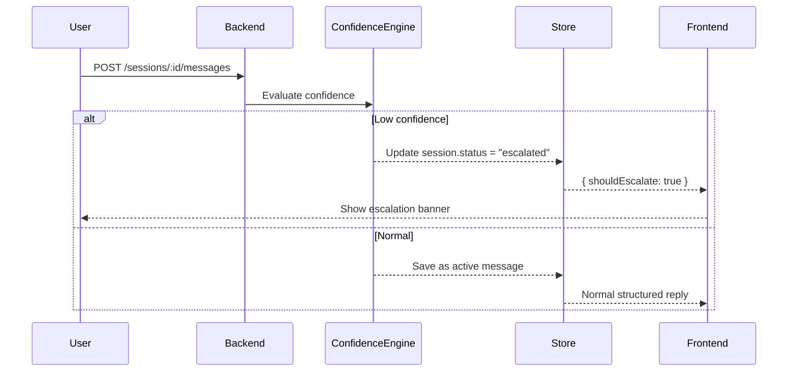

<div align="center">

# 🧠 Orion — AI Customer Support Platform

**Orion** is a multi-tenant, context-aware customer support assistant.
It blends **hybrid retrieval**, **structured LLM reasoning**, and **adaptive confidence tracking** to power human-grade chat experiences for small businesses.

---

## 🏗️ System Overview

Orion consists of two coordinated layers:

* **Frontend (Vite + React + TanStack Router)**
  Structured chat interface, setup dashboard, and escalation console.

* **Backend (Node.js + Prisma + Neon Postgres)**
  Multi-tenant API managing companies, sessions, FAQs, and messages.
  Integrates Gemini / OpenAI for response generation.

The architecture is designed for clarity, not complexity: each request follows a transparent data path from user message → contextual reasoning → confidence judgment → structured rendering.

---

[](https://www.typescriptlang.org/)
[](https://react.dev)
[](https://vitejs.dev)
[](https://nodejs.org)
[](https://www.prisma.io)
[](#)

<br/>

A production‑ready, context‑aware assistant that responds in structured JSON—rendered into clean, trustworthy UI.

</div>

---

## ✨ Highlights

- Hybrid context retrieval (Company Profile + Semantic FAQ Top‑K)
- Structured responses (summary, sections, confidence, escalation)
- Adaptive session confidence with EMA smoothing
- Multi‑tenant company context (localStorage + API scoping)
- Fast, modern stack (React 19, Vite 7, Tailwind v4, Prisma)

---

## 🧱 Monorepo Layout

```
Orion/
├── Backend/                     # Express + Prisma API
│   ├── prisma/                  # Schema + migrations
│   ├── src/                     # Routes, services, LLM, confidence
│      
│   
└── Frontend/                    # React + Vite app
    ├── src/
    │   ├── Pages/ChatPage.tsx
    │   ├── Components/Frontend_ChatMessage_Component.tsx
    │   └── hooks/useChat.ts
    ├── README.md                # Frontend readme
    └── FRONTEND_GUIDE.md        # Focused guide (this project)
```

---

## 🚀 Quickstart

```bash
# 1) Backend
cd Backend
npm install
npx prisma migrate dev
npm run dev

# 2) Frontend (in a new terminal)
cd ../Frontend
npm install
# point to backend if needed
echo "VITE_API_BASE=http://localhost:5000/api/v1" > .env.local
npm run dev
```

Open the chat at: http://localhost:5173/chat

---


## 🧩 High-Level Architecture (HLD)

```mermaid
flowchart LR
    A[User Message] --> B[Hybrid Context Retrieval]
    B -->|Embeddings + Company Profile + FAQs| C[Structured LLM Generation]
    C -->|JSON {title, summary, sections[], confidence}| D[Confidence Engine]
    D -->|EMA Smoothing + Escalation Logic| E[Session Store (Postgres)]
    E -->|Persist messages + summaries| F[Frontend Renderer]
    F -->|Structured UI| A
```

### Key Components

| Component             | Responsibility                                                             |
| --------------------- | -------------------------------------------------------------------------- |
| **Hybrid Context**    | Combines semantic FAQ retrieval + company profile summary.                 |
| **Structured LLM**    | Produces validated JSON with confidence and tone metadata.                 |
| **Confidence Engine** | Smooths confidence with EMA and flags low-confidence turns for escalation. |
| **Session Store**     | Persists all message history, summaries, and confidence traces.            |
| **Frontend Renderer** | Visualizes structured replies, confidence badges, and escalation states.   |

---

## 🔄 Message Lifecycle

1. **User Message** → Sent via `/sessions/:id/messages`
2. **Context Assembly** → Hybrid Context fetches last 6 messages, session summary, and Top-K FAQs
3. **Generation** → LLM returns structured JSON (title, sections, confidence)
4. **Evaluation** → Confidence Engine applies EMA smoothing
5. **Decision** →

   * ≥ threshold → normal reply
   * < threshold → `status=escalated`
6. **Persistence** → Message + metadata saved to Postgres
7. **Frontend Render** → Displays sections, confidence badge, escalation banner if flagged

---

## 🧮 Data Model Snapshot

Simplified from the full schema:

```
Company → FAQ[] → Session[] → Message[]
```

* **Company:** Tenant boundary, owns FAQs & sessions
* **FAQ:** Question, answer, vector embedding
* **Session:** Tracks conversation state & escalation status
* **Message:** Text, confidence, and structured metadata (JSON)

No separate *escalations* table — handled via `Session.status`.
See `ESCALATIONS_ARCHITECTURE.md` for reasoning behind this lightweight model.

---

## 🛠️ Tech Stack

- Backend: Node, Express, Prisma (PostgreSQL), Gemini API (@google/genai)
- Frontend: React 19, Vite 7, Tailwind v4, Radix UI, TanStack Router

---

## 🧪 Testing

Backend:
```bash
cd Backend
npm test
```

Frontend:
- Manual: `npm run dev` and exercise `/chat` and dashboard routes

---

## ⚙️ Intelligent Subsystems

### 1. Hybrid Context Retrieval

* Embeds query using Gemini 768-dim vectors
* Computes cosine similarity over stored FAQ embeddings
* Fuses retrieved FAQs + company profile into the LLM prompt

### 2. Confidence Engine

* Applies EMA smoothing (`α=0.2`) across turns
* Classifies outcomes via multi-threshold scheme:

  * Strong ≥ 0.8
  * Weak  0.5–0.8
  * Escalate < 0.3
* Emits `shouldEscalate` flag used by UI and session patcher

### 3. Structured Intelligence

* Enforces JSON schema for LLM responses
* Produces `meta` payload (type, title, sections, tone, confidence)
* Enables rich frontend rendering and explainable responses

---

## 🧠 Escalation Flow



Escalations appear instantly in `/dashboard/escalations`, handled via session filters.

---

## 🧱 System Design Principles

1. **Transparency** — Every response carries structured metadata.
2. **Simplicity** — Escalations live inside the session lifecycle.
3. **Context Preservation** — Short-term memory per session, not global state.
4. **Graceful Degradation** — Works in mock mode without external LLMs.
5. **Scalability** — Swappable vector backend (e.g., Pinecone or pgvector).

---

## 🚀 Extensibility

| Extension                | Benefit                                               |
| ------------------------ | ----------------------------------------------------- |
| **Vector DB Migration**  | Enables sub-second semantic search at scale           |
| **Analytics Dashboard**  | Confidence trends, FAQ performance, escalation ratios |
| **Agent Queueing**       | Human takeover assignment & SLA tracking              |
| **Multilingual Support** | Translated FAQs and localized context retrieval       |

---

## 📚 Related Documentation

* `FRONTEND_GUIDE.md` – Frontend setup, routing, and structured chat rendering
* `Orion Backend API Reference (v1)` – Endpoint specifications
* `ESCALATIONS_ARCHITECTURE.md` – Session-based escalation design
* `IMPLEMENTATION_COMPLETE.md` – Full phase log & production readiness summary

---

## ✨ Summary

Orion unifies **retrieval, reasoning, and responsibility** into one consistent system:

> Hybrid context gives it memory,
> structured intelligence gives it form,
> confidence tracking gives it judgment.

Together, these make Orion a real, production-grade customer-support AI — not just a chatbot.

